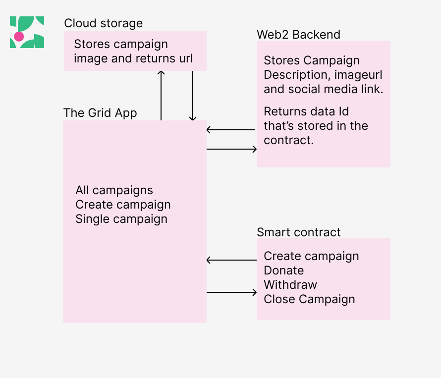

# Golyxme - On-Chain Crowdfunding

## Quick Demo

[Watch Here](https://youtu.be/DQBD7JRlagw)

## Project Link

[Visit app on the grid](https://universaleverything.io/0x84707Cf6b623C7d77a2b32f022e67F6Bb7cB1eB2)

## Project Link

[Visit app on web](https://golyxme.vercel.app/)

## Architecture

## Overview

Crowdfunding can become more seamless and attract on-chain donors, increasing reach and spread for genuine causes.

I believe blockchain should be utilized to create much-needed social impact, and one way to achieve this is by enabling crowdfunding on-chain.

## About Golyxme

Golyxme seeks to accomplish this by implementing a crowdfunding protocol that ensures accessibility for campaigners and transparency for donors.

### Key Features:

- **Transparent Fundraising:** Donors can track total funds raised, funding targets, and contribution counts.
- **Social Proof:** Campaigns include links to social media posts for verification.
- **Effortless Withdrawals:** Campaign creators can seamlessly access donated funds.

By leveraging blockchain technology, Golyxme aims to make crowdfunding more efficient, transparent, and impactful.
